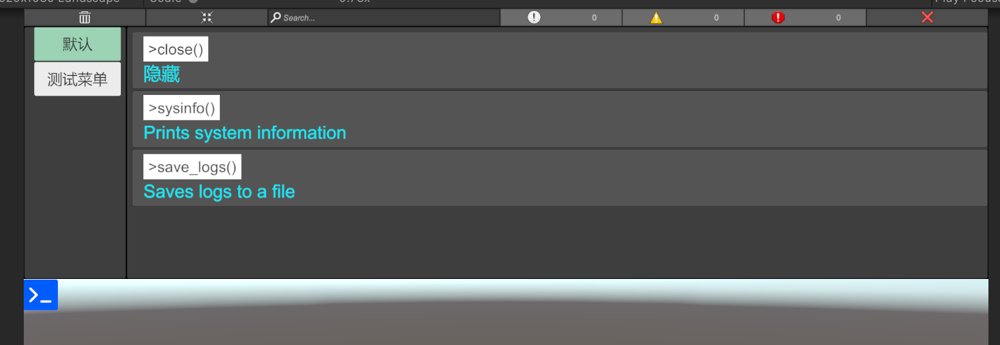
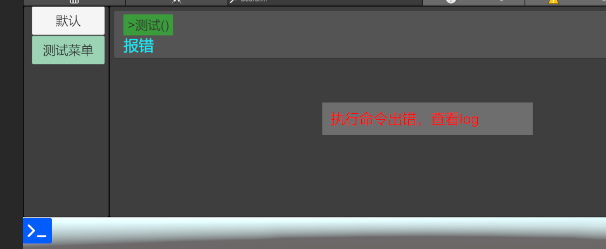

# IngameDebugConsole
A uGUI based console to see debug messages and execute commands during gameplay in Unity

从 [IngameDebugConsole](https://github.com/yasirkula/UnityIngameDebugConsole) 拷贝过来的，加了一些自己需要的功能

